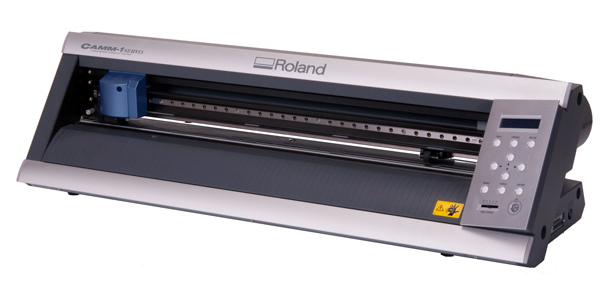

  

<h2 align="center">
Questa pagina raccoglie i macchinari che puoi utilizzare al FabLab Torino e tutto ciò che devi sapere prima di usarli!
</h2>

***
***

# Vinylcut

  

link alla 
[pagina dedicata](/vinylcut/index.md)

# Lasercut

link alla 
[pagina dedicata](/lasercut/index.md)

# 3D printer

link alla 
[pagina dedicata](/3d-printer/index.md)
