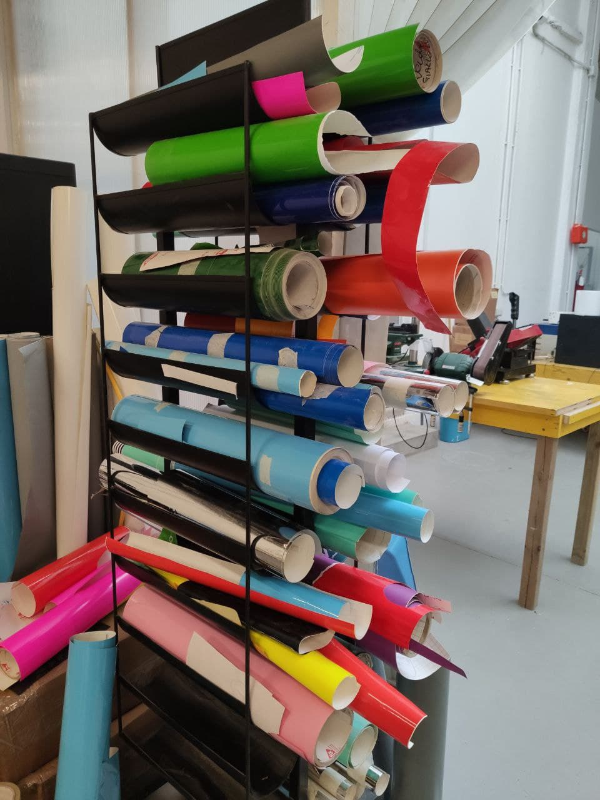

# Vinylcut

## Cosa si può fare con la Vinylcut
È un macchinario a controllo numerico utilizzato per il taglio di fogli di plastica autoadesiva (chiamata vinile) e materiali in fogli con uno spessore massimo di 0,5 mm.    
[Per maggiori informazioni](https://en.wikipedia.org/wiki/Vinyl_cutter)

Tramite vinylcut si possono produrre banner, striscioni, prespaziati, grafica veicolare, insegne, segnaletica, vetrofanie, retroilluminati, stencil e termo-adesivi per magliette. È inoltre possibile trasformare la macchina in un plotter da disegno a penna, grazie ad appositi adattatori. 

[esempio 1](inserire immagine)   
Foto e link dell'esempio.

Esempi di lavorazione. (Applicazioni)

## Strumenti e file 
Per il taglio dei vinili è ovviamente necessaria una Vinylcut con tutti i suoi accessori utili. Questa deve però essere collegata ad un computer (fornito dal Fablab) contenente i driver e i programmi necessari. Infine serve il materiale da tagliare, è possibile portarlo da fuori, ma se ne può trovare un ampio campionario in sede.   

<!-- Sostituire immagine con foto del tavolo con tutto sopra. Mettere scritte per dire cosa sono i vari elementi (Campionario, PC, schermo, vinylcut ecc.) -->
 

### Vinylcutter Roland CAMM-1 SERVO GX-24

| Caratteristiche tecniche           | Valori                                   |   
|:-----------------------------------|:-----------------------------------------|   
| Velocità di taglio                 | Da 10 a 500 mm/sec. (tutte le direzioni) |   
| Pressione della lama               | Da 30 a 250 gf                           |   
| Risoluzione del Software           | 0,025 mm/passo                           |   
| Spessore massimo del materiale     | 0,5 mm                                   |   
| Larghezza del materiale caricabile | Da 50 a 700 mm                           |   
| Grandezza massima area di taglio   | Larghezza: 584 mm Lunghezza: 25 m        |   
| Grandezza minima area di taglio    | Larghezza:  Lunghezza:                   |   
| Precisione di ripetizione          | ±0.1 mm o inferiore                      |      

Per informazioni più specifiche consultare la [scheda tecnica](src/Scheda-tecnica.pdf) e il [manuale dell'utente](src/Users-Manual%20(EN).pdf)

<!-- Aggiungere foto della Vinylcut con i nomi delle componenti principali -->

### Materiali
I materiali più utilizzati sono [vinile](http://www.tosingraf.com/vinili-adesivi-da-stampa-e-taglio.html), [poliestere](https://www.cplfabbrika.com/transfer/transfer-laser/poliestere-adesivo-stampabile.html) e [sandblast](https://www.fcsrl.com/categoria-prodotto/vinile-per-sabbiatura/), ma gestisce tranquillamente anche materiali più pesanti come [PVC flessibili](https://www.sinovinyl.com/product/color-pvc-graphic-cutting-vinyl-roll-film/), [floccati](https://tuttotransfer.it/termoadesivi-flex-e-flock-/termoadesivi-flock-floccato-velluto-scamosciato/) e [vinili riflettenti](https://stampacontinua.it/index.php?route=product/category&path=1437_1441).   
Lo spessore e le dimensioni del materiale dipendono dal macchinario e dalla lama di taglio, vedere le [caratteristiche tecniche](#vinylcutter-roland-camm-1-servo-gx-24)

### PC coi software
Computer con sistemi operativi successivi a Windows 98 SE.   
I plotter da taglio Roland sono equipaggiati con il software [CutStudio](https://www.rolanddg.it/prodotti/software/roland-cutstudio-software). Il software consente di creare loghi e scritte e di modificarli, allargandoli, ruotandoli, specchiandoli e scalandoli.

### File 
Il computer presente in laboratorio e collegato alla Vinylcut possiede i software necessari alle fasi di [preparazione del file](#preparare-il-file--todo) e [taglio](#mandare-in-taglio).
#### Cutstudio    
Supporta file di formato BMP, JPG, STX, AI ed EPS. Accetta inoltre immagini acquisite da scanner TWAIN 32. 

#### Plug in per Inkscape   
Un'[estensione di Inkscape](https://wiki.inkscape.org/wiki/index.php/Inkscape_Extensions) permette di inviare il file di taglio a Cutsudio, ampliando le tipologie di file supportati da Cutstudio. Supporta file di formato SVG, STX AI, DXF, CDR, PDF, BMP, JPG, PNG e TIFF.

### Accessori (forbici taglierini ecc.)
Adattatore di corrente, cavo di alimentazione, lama, porta lama, taglierino di separazione, base del rullo, pinzette, materiale di prova, nastro applicativo, cavo USB, CD-ROM, manuale d’uso 

## Il processo di taglio
Per tagliare i fogli in vinile segui i passaggi illustrati in seguito.

### Accensione
Accendere computere schermo e assicurarsi che il cavo USB sia collegato alla vinycut.
  

Accendere il macchinario tramite il tasto __POWER__ .   

### Caricare il materiale 
Abbassare la leva di caricamento (_loading lever_) sul retro a sinistra.
<!--  Foto della leva e freccia con la direzione per abbassarla -->
   

Inserire posteriormente  il materiale facendolo scorrere attraverso la fessura della macchina e, se necessario, appoggiarlo al __portarotolo__.    

Spostare i due rulli di fissaggio (_pinch roller_) negli spazi bianchi segnati, facendoli scorrere dalla parte posteriore della macchina. 
   

Posizionare il materiale in modo che sia parallelo alle linee guida (_guide lines_) in rilievo alla base del macchinario e alzare la leva di caricamento (_loading lever_) per fissare il materiale alla Vinylcut.   
   

Sul display del _operation panel_ (pannello di controllo) compare la scritta "CARICO FOGLIO". Premere __↑__ o __↓__ sulla pulsantiera per sbloccare la selezione del supporto. Quindi scegliere con i tasti __←__ o __→__ il tipo di supporto utilizzato, tra "ROTOLO", "FOGLIO" o "BORDO". Infine premere __ENTER__ per confermare la scelta.  

### Preparare il file
Tramite USB mettere i file sul computer collegato al macchinario. Il file deve essere in uno dei formati citati in nella [sezione file](#file).   

Se il formato file è tra quelli letti da [Inkscape](#plug-in-per-inkscape), aprire quindi il programma (di seguito la schermata iniziale).   
   

Per aprire il file contenente il contorno di taglio, seguire il percorso __file__>__importa__>selezionare il file.  
   

È buona pratica fare un controllo delle linee per evitare linee doppie ed errori durante il taglio. Per cambiare la visualizzazione seguire il percorso __visualizza__>__modalità visualizzazione__>__scheletro__.  
   

Grazie all'[estensione](#plug-in-per-inkscape) è quindi possibile aprire il file direttamente su Cutstudio, seguendo il percorso __estensioni__>__Roland__>__open in Cutstudio__.   

Se il formato file è tra quelli letti da [Cutstudio](#cutstudio) si può decidere di aprire il file direttamente su questo programma seguendo il percorso (vedere percorso).   
   

Aperto il file su Cutstudio, l'interfaccia si presenterà così.   
      

LA Vinylcut durante il [caricamento del materiale](#caricare-il-materiale) misura in automatico la dimensione della superficie utile di taglio. Per riportare queste misure sul foglio di lavoro seguire il percorso __tagliare__>__modifica__>__proprietà__>__get from machine__. Confermare quindi l'operazione cliccando su __ok__ nelle prime due finestre, ma facendo attenzione a selezionare __annulla__ nell'ultima (come mostrato in foto).   
   

È ora possibile ridimensionare e spostare il contorno di taglio.   
Per ridurre lo spreco di materiale conviene utilizzare il comando __spostare__ (in alto a destra) per posizionare i contorni in corrispondenza dell'origine di taglio.   
Per ridurre o aumentare le dimensioni del contorno si può agire sulle frecce agli angoli del file (tenendo premuto __SHIFT__ per mantenere le proporzioni) o, per avere una misura precisa, modificare i valori nella colonna destra (spuntare la casella __Conserva Aspetto__ per mantenere le proporzioni).   

### Impostare i parametri di taglio
Con diversi tipi di [materiali da tagliare](#materiali) e diversi spessori, la lama ha bisogno di più o meno forza (misurata in gf) per ottenere un taglio preciso e pulito. La pressione applicata dalla lama può essere modificata dal _operation panel_ (pannello di controllo) premendo sul tasto __FORCE__. Premere __←__ o __→__ sulla pulsantiera per sbloccare la selezione, quindi modificare i grammi forza con __↑__ e __↓__ e premere infine __ENTER__ per confermare la selezione.
   

Il _display_ dovrebbe ora indicare la pressione della lama (espressa in gf), ma anche la velocità di taglio e la distanza di Offset. Quest'ultima dipende dalla lama montata ed è importante per avere dei cambi di direzione nel taglio precisi. Assicurarsi sempre che l'Offset indicato coincida con quello della lama in utilizzo.     
   

Prima di procedere al taglio è buona pratica fare dei test per assicurarsi che tutti i parametri di taglio siano adatti. Tramite i tasti __←__ e __→__ si posiziona il _cutting carriage_ (carrello di taglio contenente la lama) in uno spazio inutilizzato, quindi premere il tasto __TEST__ per almeno un secondo.   
Il taglio è ben fatto se si riesce a spellicolare il cerchio senza rimuovere il quadrato al suo interno e se la superficie dello strato protettivo è segnata (vedere foto di seguito).  

### Mandare in taglio
Prima di avviare il taglio è bene impostare il punto di origine. se si ha un foglio come supporto il punto di origine è sempre nell'angolo in basso a sinistra, invece nel caso del rotolo il punto di origine dipende dalla posizione di caricamento. In quest'ultimo caso è utile cambiare il punto di origine del taglio: spostare il _cutting carriage_ (carrello di taglio contenente la lama) nel punto di origine desiderato con i tasti __←__, __→__, __↑__ e __↓__. Nella posizione desiderata premere __ORIGIN__ sul _operation panel_ (pannello di controllo).

Si può dunque avviare il taglio da Cutstudio, seguendo il percorso __tagliare__>__ok__.     

Durante il taglio è bene controllarne l'esecuzione. Nel caso di lievi imperfezioni nella pressione della lama, è possibile regolarla ulteriormente grazie allo slider __PEN FORCE__.
Sulla superficie del materiale sarà visibile il contorno tagliato dalla Vinylcut.   
A taglio eseguito si può portare in avanti il materiale con il tasto __↓__ del _operation panel_ (pannello di controllo) e nel caso si stia utilizzando un rotolo, tagliare il rettangolo lavorato.
   

A fine lavorazione o per cambiare il materiale bisogna estrarre il rotolo o il foglio. Questo passaggio è simile alla [fase di caricamento](#caricare-il-materiale) e consiste nell'alzare la _loading lever_ (leva di caricamento) ed estrarre il materiale.   

### Spegnimento 
A fine utilizzo, spegnere la Vinylcut tenendo premuto il tasto __POWER__.   
   

Espellere la USB dal computer tramite la rimozione sicura dell'hardware, come mostrato in figura.   
   

Procedere infine con lo spegnimento del computer tramite Arresto del sistema. Per ultimo spegnere lo schermo del computer, premendo l'apposito tasto.  
   

## Il post-processing
Per iniziare il post-processing, dopo aver separato la zona con il contorno tagliato, si deve rimuovere l'adesivo in eccesso. Nel caso di forme complesse si dovrà spellicolare sia la parte esterna, sia quella interna al contorno di taglio.   
  

Per poter trasferire l'adesivo della carta protettiva alla superficie di applicazione, bisogna usare il [_Transfer_ o pellicola di trasferimanto](https://www.necchishop.com/prodotto/pellicola-per-il-trasferimento/). Tagliare dunque un pezzo di _Transfer_ abbastanza grande da coprire tutto lo sticker.   
   

Applicare quindi il _Transfer_ assicurandosi di avere una adesione completa e omogenea allo sticker. Per questo passaggio ci si può aiutare con oggetti con almeno un lato dritto, come spatole o anche carte elettroniche (tipo la tessera del Fablab!). Per una ulteriore prova si può sollevare leggermente il _Transfer_ e controllare che lo sticker vi rimanga attaccato, come mostrato in foto.  
   

Finalmente si può applicare lo sticker sulla superficie desiderata!   
Separare il transfer e l'adesivo dalla carta protettiva, posizionarlo sulla superficie scelta e incollarlo in modo omogeneo.   
